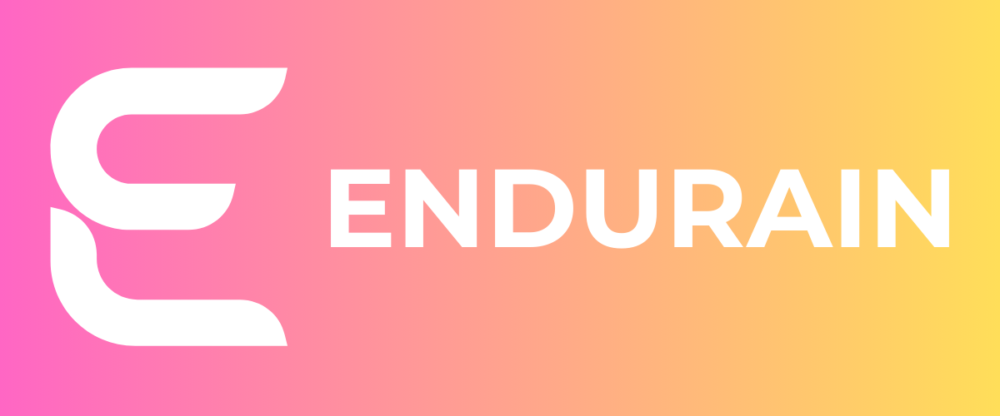

# Endurain

  

## A self-hosted fitness tracking service

Endurain is a self-hosted fitness tracking service designed to give users full control over their data and hosting environment. It's similar to Strava but focused on privacy and customization.

- [Documentation](https://docs.endurain.com)
- [Server repo](https://github.com/endurain-project/endurain)
- [Mobile app repo](https://github.com/endurain-project/endurain-flutter)

## 🚀 Try the Demo

Experience Endurain without installation:

**Demo URL:** [https://demo.endurain.com](https://demo.endurain.com)

- **Username:** `admin`
- **Password:** `admin`
- **Reset Schedule:** Daily at midnight (Europe/Lisbon timezone)

> ⚠️ **Note:** The demo environment resets every day. Do not store important data.